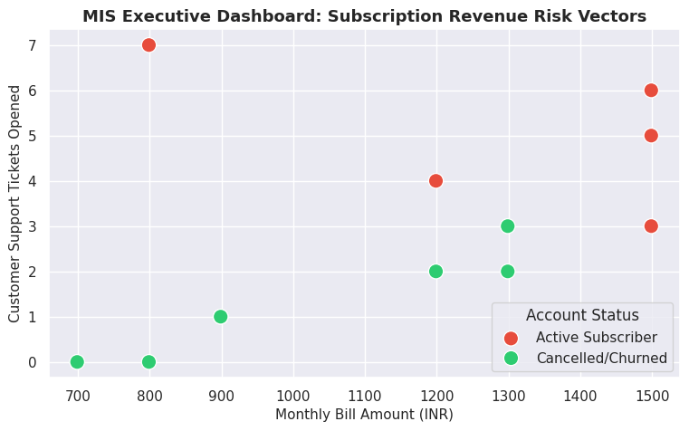

# 📉 Automated Customer Churn & Business Revenue Risk Pipeline

An end-to-end data analytics and machine learning classification pipeline designed to calculate revenue leakage, clean transactional customer billing logs, and flag subscriber accounts with a high risk of cancelling.

## 💼 Business Scenario & Use Case
Subscription-based operations depend heavily on retention. This system automates the processing of customer accounts, instantly generates core management indicators like **MRR At Risk**, and uses a classification algorithm to flag vulnerable customer accounts based on customer service complaints and spending weights.

## ⚙️ Core Modules
* **Data Cleansing Layer:** Cleans trailing structural syntax gaps from string categories and maps missing financial columns using statistical column medians.
* **MIS Revenue Management Reports:** Evaluates total portfolio health indices, highlighting active cancellation percentages and active capital exposures.
* **Predictive ML Classification:** Standardizes features into Scikit-Learn Logistic Regression matrices to isolate high-risk user vectors before contract termination events occur.

## 🖼️ Dashboard Preview

